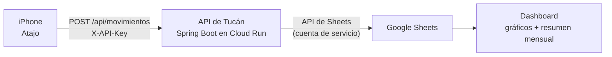

# Tucán

**Registrar un gasto en cinco segundos, desde la pantalla bloqueada del teléfono.**

[English](README.md) · Java 21 · Spring Boot 3.3 · Google Sheets API · Cloud Run

> **Estado: en construcción.** La API está hecha y ya escribe en la hoja real: modelo
> del dominio, validación, integración con Sheets, manejo de errores y filtro de API
> key, con 114 tests que lo cubren. Siguen el despliegue y el atajo de iOS. En el
> [Roadmap](#roadmap) está exactamente qué existe hoy.

---

## El problema

He probado una docena de apps de finanzas personales. Siempre las abandono por lo
mismo, y nunca fueron las funcionalidades: es la fricción. Pagar un café toma quince
segundos; abrir la app, esperar a que cargue, pasar por cuatro pantallas y elegir una
categoría de una lista toma más que la compra misma. Entonces uno lo pospone. Y con
tres gastos pospuestos el mes ya no es confiable, así que uno deja de anotar.

La otra mitad del problema es la propiedad de los datos. Casi todas esas apps guardan
tu historial financiero en sus servidores, detrás de una suscripción. La cancelás y tus
datos se van, o quedan atrapados en una exportación que en realidad nunca abrís.

Tucán es mi respuesta a las dos cosas: **la menor fricción físicamente posible, y los
datos en una hoja de cálculo que es mía.**

## Cómo funciona



Desde la pantalla bloqueada: tocar el atajo, responder tres o cuatro preguntas (monto,
categoría, cómo pagaste), listo. La fila llega a la hoja antes de que imprima el recibo
de la tarjeta.

Sin app que instalar, sin cuenta que crear, sin suscripción. La hoja de cálculo es la
base de datos, y de paso trae un motor de gráficos gratis.

## Decisiones de diseño que vale la pena leer

Esta es la parte que realmente me interesaría que alguien mire. Un endpoint CRUD es un
endpoint CRUD; lo interesante está en otro lado.

### El dominio se modela con enums, no con strings

Una categoría podría ser un `String`. No debería serlo. Con strings, `"gastos"`,
`"Gastos"` y `"gastoo"` son válidos hasta que alguien abre la hoja en diciembre y
encuentra cuatro formas de escribir la misma categoría, ninguna de las cuales suma.

Cada categoría es una constante de un enum que carga su propia etiqueta legible, y
**la categoría sabe a qué tipo de movimiento pertenece**. Esa sola decisión hace
imposible registrar un gasto bajo una categoría de salario: la validación es una
comparación, no un reglamento. Además permite que la API sirva la lista de categorías
ya filtrada por tipo, que es justo lo que el atajo necesita para armar sus dos menús.

### La configuración falla al arrancar, nunca a media petición

La aplicación lee todo de variables de entorno y **se niega a arrancar** si falta algo
obligatorio. La alternativa — enterarte de que faltan las credenciales cuando el
teléfono devuelve un error críptico en plena compra — es mucho peor que un arranque
fallido.

Lograrlo requirió un experimento real. El enfoque obvio (placeholders en
`application.yml` más `@NotBlank`) no hace absolutamente nada:

- Spring resuelve los `${...}` de forma **perezosa**. Si ningún componente lee la
  propiedad, la variable faltante nunca se nota y la app arranca feliz.
- Peor todavía: el binder de `@ConfigurationProperties` corre con
  `ignoreUnresolvablePlaceholders = true`. Cuando la variable no existe, asigna el
  **texto literal** `"${API_KEY}"` — que no está en blanco, así que `@NotBlank` pasa.

Por eso la validación vive en el constructor compacto del record y rechaza
explícitamente los placeholders sin resolver. Verificado ejecutándolo: sin las
variables, la app muere nombrando cuál falta; con ellas, Tomcat atiende normalmente.

### Las credenciales viajan en base64, por el entorno

La llave de la cuenta de servicio de Google es un JSON multilínea. Esos saltos de línea
se corrompen al pasar por terminales, paneles web y campos de formulario, y una llave
privada corrupta produce un error que no dice nada útil. En base64 queda una sola línea
larga que sobrevive a cualquier copiar y pegar.

En tiempo de ejecución nunca toca el sistema de archivos. El mismo `.jar` la lee de la
configuración del IDE en local y de Secret Manager en producción: mismo binario, sin
recompilar, sin una sola línea de código que sepa qué es un archivo.

### El ahorro se registra como gasto

La decisión que más costó cerrar, y es de dominio más que técnica.

La plata que movés a ahorro sigue siendo tuya, así que tratarla como ingreso se siente
natural. También duplica dinero: el salario ya se anotó una vez, y anotar la
transferencia como ingreso cuenta la misma plata de nuevo.

```
Cae el salario        →  Ingreso,  Salario            650.000
Movimiento a ahorro   →  Ingreso,  Ahorro             100.000
                                                      -------
La hoja dice que entraron                             750.000
En realidad entraron                                  650.000
```

Como gasto no se duplica nada, y el balance refleja lo que realmente podés gastar. El
costo es honesto: tu tasa de ahorro real es mejor que la que reporta el resumen, porque
lo ahorrado se resta como si se hubiera gastado. Es un compromiso documentado, no un
bug — y la salida limpia, si algún día molesta, es un tercer tipo de movimiento.

## Stack técnico

| Capa | Elección | Por qué |
|---|---|---|
| Lenguaje | Java 21 | Records y pattern matching mantienen compacto el modelo de dominio |
| Framework | Spring Boot 3.3 | Validación, inyección y servidor embebido sin ceremonia |
| Almacenamiento | Google Sheets API | Ya sé leerla, y grafica gratis |
| Hosting | Cloud Run | Escala a cero: una API que se usa diez veces al día no debe correr 24/7 |
| Secretos | Secret Manager | Nada sensible en la imagen ni en el repositorio |
| Build | Maven | |
| Cliente | Atajo de iOS | Sin app que instalar, y vive en el Centro de Control |

## Arquitectura

```
com.tucan.api
├── config/      Propiedades de configuración, cliente de Google Sheets
├── model/       Enums del dominio (tipo, categoría, medio de pago)
├── dto/         Records de petición y respuesta con validaciones
├── service/     Reglas de negocio y escritura en la hoja
└── controller/  Endpoints REST
```

Inyección por constructor en todos lados, records inmutables para todo lo que transporte
datos, y validación en el borde del sistema en vez de repartida por la capa de servicio.

## Cómo correrlo en local

Necesitás Java 21, un proyecto de Google Cloud con la API de Sheets habilitada, y una
cuenta de servicio con acceso de editor a tu hoja de cálculo.

```bash
git clone <este-repo>
cd tucan-api

# La llave de la cuenta de servicio se convierte en una sola línea base64
base64 -i /ruta/a/tus-credenciales.json | tr -d '\n'
```

Definí tres variables de entorno, en la configuración de ejecución de tu IDE o
exportadas en la terminal:

| Variable | Qué es |
|---|---|
| `API_KEY` | Cualquier cadena aleatoria; la API rechaza peticiones sin ella |
| `SPREADSHEET_ID` | El bloque entre `/d/` y `/edit` en la URL de la hoja |
| `GOOGLE_CREDENTIALS_BASE64` | La salida base64 de arriba, en una sola línea |

```bash
./mvnw spring-boot:run
```

Arranca en el puerto 8080, o en `$PORT` si está definido — que es justo lo que Cloud Run
configura automáticamente.

Para comprobar que el arranque fail-fast funciona, quitá cualquiera de las tres y
arrancá de nuevo: debe negarse a iniciar y decir cuál falta.

Si vas a commitear, activá una vez el hook de pre-commit. Git no versiona la
configuración de los hooks, así que clonar no alcanza:

```bash
git config core.hooksPath .githooks
```

## Seguridad

En este repositorio no vive nada sensible, y la estructura hace difícil equivocarse:

- La raíz de git es la carpeta de la aplicación. Las credenciales y las notas del
  proyecto están **dos niveles más arriba**, fuera del repo: git no las ve ni por
  accidente.
- El `.gitignore` además bloquea por nombre archivos de credenciales, `.env`, perfiles
  locales de Spring y material criptográfico, por si alguna vez se copia uno adentro.
- Un hook de pre-commit versionado (`.githooks/pre-commit`) rechaza el commit si algún
  archivo preparado trae un secreto escrito literal. El `.gitignore` no puede cubrir
  este caso: los `.bru` de Bruno **sí** se versionan a propósito, y Bruno los reescribe
  con lo que uno teclea en su interfaz, así que la API key puede terminar dentro de un
  archivo seguido sin que nadie lo haya decidido. Pasó durante el desarrollo, y por eso
  existe el hook.
- El archivo de configuración contiene solo **nombres** de variables, nunca valores.
- En producción, Cloud Run inyecta los secretos desde Secret Manager al arrancar el
  contenedor.
- Toda petición lleva una API key, verificada por un filtro antes de llegar a un
  controlador.

Una aclaración honesta: base64 es **codificación, no cifrado**. Resuelve el problema de
los saltos de línea, nada más. La llave codificada se trata igual que el archivo
original.

## Roadmap

Construido como un backlog de 46 tickets. Dónde va la cosa:

**Hecho**
- [x] Infraestructura: proyecto en Cloud, cuenta de servicio, hoja, alerta de presupuesto
- [x] Esqueleto de Spring Boot — compila, arranca, tests en verde
- [x] Configuración externalizada con validación fail-fast
- [x] Enums del dominio, DTOs de petición y validación cruzada
- [x] Cliente autenticado de Google Sheets y escritura de filas
- [x] Endpoints REST y filtro de API key
- [x] Manejo de errores centralizado, con un solo formato de respuesta
- [x] Colección de Bruno, incluidas ocho peticiones que tienen que fallar
- [x] Protección de secretos: `.gitignore` y un hook de pre-commit versionado

La API está completa y escribe en la hoja real. Pasan 114 tests.

**Sigue — Hito 1: usable desde el teléfono**
- [ ] Dockerfile, Secret Manager, despliegue en Cloud Run
- [ ] Atajo de iOS y acceso desde el Centro de Control

**Hito 2: que conteste**
- [ ] Lectura desde la hoja, cálculo del resumen mensual
- [ ] `GET /api/resumen` y atajo de consulta a demanda
- [ ] Cierre de mes programado, notificación push, correo mensual
- [ ] Tabla histórica y gráfico de evolución

## Por qué lo construí

Quería un backend que fuera a usar todos los días, porque ese es el tipo de proyecto
donde los atajos se devuelven a morderte. Una API de juguete puede sobrevivir con
validaciones flojas y configuración quemada en el código; una que escribe en tu
historial financiero real durante meses, no.

También ha sido un ejercicio deliberado de escribir el *porqué*. Casi cada decisión acá
tiene un párrafo explicando el compromiso que implica — incluidas las que haría
distinto la próxima vez.

---

*Tucán — por el ave.*
