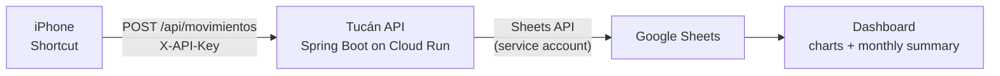

# Tucán

**Log an expense in five seconds, from your phone's lock screen.**

[Español](README.es.md) · Java 21 · Spring Boot 3.3 · Google Sheets API · Cloud Run

> **Status: in progress.** The skeleton and configuration layer are built and tested.
> The REST API, the Sheets integration and the iOS Shortcut are next. See
> [Roadmap](#roadmap) for exactly what exists today.

---

## The problem

I have tried a dozen personal finance apps. I always quit for the same reason, and it
was never the features — it was the friction. Paying for coffee takes fifteen seconds;
opening an app, waiting for it to load, tapping through four screens and picking a
category from a list takes longer than the purchase itself. So you postpone it. And
once you have postponed three expenses, the month is already unreliable, and you stop.

The other half of the problem is ownership. Most of these apps keep your financial
history inside their servers, behind a subscription. Cancel it and your data is gone,
or trapped in an export you never actually read.

Tucán is my answer to both: **as little friction as physically possible, and the data
stays in a spreadsheet I own.**

## How it works



From the lock screen: tap the Shortcut, answer three or four questions (amount,
category, how you paid), done. The row lands in the spreadsheet before the card
receipt prints.

No app to install, no account to create, no subscription. The spreadsheet is the
database, and it happens to come with a charting engine for free.

## Design decisions worth reading

This is the part I would actually want someone to look at. A CRUD endpoint is a CRUD
endpoint — the interesting choices are elsewhere.

### The domain is modelled with enums, not strings

A category could be a `String`. It shouldn't be. With strings, `"gastos"`, `"Gastos"`
and `"gastoo"` are all valid until someone opens the spreadsheet in December and finds
four spellings of the same category, none of which add up.

Every category is an enum constant carrying its own human label, and **the category
knows which movement type it belongs to**. That single decision means an expense can
never be recorded under a salary category: the validation is a comparison, not a
rulebook. It also means the API can serve a filtered category list, which is exactly
what the Shortcut needs to build its two menus.

### Configuration fails at startup, never mid-request

The app reads everything from environment variables and **refuses to start** if
something required is missing. The alternative — discovering the credentials are
missing when your phone returns a cryptic error mid-purchase — is much worse than a
failed boot.

Getting this right took an actual experiment. The obvious approach (placeholders in
`application.yml` plus `@NotBlank`) silently does nothing:

- Spring resolves `${...}` placeholders **lazily**. If no component reads the property,
  a missing variable is never noticed and the app boots happily.
- Worse, the `@ConfigurationProperties` binder runs with
  `ignoreUnresolvablePlaceholders = true`. When the variable is absent it assigns the
  **literal string** `"${API_KEY}"` — which is not blank, so `@NotBlank` passes.

So the validation lives in the record's compact constructor and explicitly rejects
unresolved placeholders. Verified by running it: with variables missing, the app dies
naming the variable; with them present, Tomcat serves normally.

### Credentials travel as base64, through the environment

The Google service account key is a multi-line JSON blob. Those newlines get mangled by
terminals, web panels and form fields, and a mangled private key produces an error
message that tells you nothing useful. Base64 makes it one long line that survives any
copy-paste.

It never touches the filesystem at runtime. The same `.jar` reads it from an IDE run
configuration locally and from Secret Manager in production — same binary, no rebuild,
no code path that knows what a file is.

### Savings are recorded as an expense

The one that took the longest to settle, and it is a domain decision rather than a
technical one.

Money moved into savings is still yours, so treating it as income feels natural. It
also double-counts: your salary was already recorded once, and recording the transfer
as income counts the same money twice.

```
Salary arrives       →  Income,  Salary            650,000
Moved to savings     →  Income,  Savings           100,000
                                                   -------
The sheet claims you earned                        750,000
You actually earned                                650,000
```

As an expense nothing is double-counted, and the balance reflects what you can actually
spend. The cost is an honest one: your real savings rate is better than the summary
reports, because saved money is subtracted as if spent. That is a documented trade-off,
not a bug — and the clean fix, if it ever becomes annoying, is a third movement type.

## Tech stack

| Layer | Choice | Why |
|---|---|---|
| Language | Java 21 | Records and pattern matching keep the domain model compact |
| Framework | Spring Boot 3.3 | Validation, DI and an embedded server without ceremony |
| Storage | Google Sheets API | I already know how to read it, and it charts for free |
| Hosting | Cloud Run | Scales to zero — an API used ten times a day shouldn't run 24/7 |
| Secrets | Secret Manager | Nothing sensitive in the image or the repository |
| Build | Maven | |
| Client | iOS Shortcut | No app to install, and it lives in the Control Center |

## Architecture

```
com.tucan.api
├── config/      Configuration properties, Google Sheets client
├── model/       Domain enums (type, category, payment method)
├── dto/         Request/response records with validation
├── service/     Business rules and spreadsheet writes
└── controller/  REST endpoints
```

Constructor injection throughout, immutable records for anything carrying data, and
validation at the boundary rather than sprinkled through the service layer.

## Running it locally

You will need Java 21, a Google Cloud project with the Sheets API enabled, and a
service account with editor access to your spreadsheet.

```bash
git clone <this-repo>
cd tucan-api

# The service account key becomes one base64 line
base64 -i /path/to/your-credentials.json | tr -d '\n'
```

Set three environment variables — in your IDE's run configuration, or exported in the
shell:

| Variable | What it is |
|---|---|
| `API_KEY` | Any random string; the API rejects requests without it |
| `SPREADSHEET_ID` | The chunk between `/d/` and `/edit` in the spreadsheet URL |
| `GOOGLE_CREDENTIALS_BASE64` | The base64 output from above, a single line |

```bash
./mvnw spring-boot:run
```

The app starts on port 8080, or on `$PORT` if defined — which is what Cloud Run sets
automatically.

If you plan to commit, enable the pre-commit hook once per clone. Git does not version
hook configuration, so cloning is not enough:

```bash
git config core.hooksPath .githooks
```

To confirm the fail-fast behaviour works, unset any of the three and start it again: it
should refuse to boot and name the missing variable.

## Security

Nothing sensitive lives in this repository, and the layout makes that hard to get wrong:

- The git root is the application folder. Credentials and project notes sit **two levels
  above it**, outside the repo — git cannot see them even by accident.
- `.gitignore` also blocks credential files, `.env`, local Spring profiles and key
  material by name, in case one is ever copied inside.
- A versioned pre-commit hook (`.githooks/pre-commit`) rejects the commit if a staged
  file carries a literal secret. `.gitignore` cannot cover this: the Bruno `.bru` files
  *are* meant to be versioned, and Bruno rewrites them with whatever you type into its
  UI — so the API key can end up inside a tracked file without anyone deciding to put it
  there. It happened during development, which is why the hook exists.
- The config file contains only **variable names**, never values.
- In production, secrets are injected by Cloud Run from Secret Manager at container
  start.
- Every request carries an API key, checked by a servlet filter before it reaches a
  controller.

One honest note: base64 is **encoding, not encryption**. It solves the newline problem,
nothing else. The encoded key is treated exactly like the original file.

## Roadmap

Built as a 46-ticket backlog. Where things stand:

**Done**
- [x] Infrastructure: Cloud project, service account, spreadsheet, budget alert
- [x] Spring Boot skeleton — builds, boots, tests green
- [x] Externalised configuration with fail-fast validation

**Next — Milestone 1: usable from the phone**
- [ ] Domain enums, request DTOs and cross-field validation
- [ ] Authenticated Google Sheets client and row writes
- [ ] REST endpoints and API key filter
- [ ] Error handling and a Bruno request collection
- [ ] Dockerfile, Secret Manager, Cloud Run deployment
- [ ] iOS Shortcut and Control Center access

**Milestone 2: it talks back**
- [ ] Read from the sheet, monthly summary calculation
- [ ] `GET /api/resumen` and an on-demand query Shortcut
- [ ] Scheduled month-end close, push notification, monthly email
- [ ] Historical table and trend chart

## Why I built it

I wanted a backend I would use every single day, because that is the kind of project
where shortcuts come back to bite you. A toy API can get away with loose validation and
hardcoded config; one that writes to your real financial history for months cannot.

It has also been a deliberate exercise in writing down the *why*. Most decisions here
have a paragraph explaining the trade-off — including the ones I would do differently
next time.

---

*Tucán — named after the bird.*
